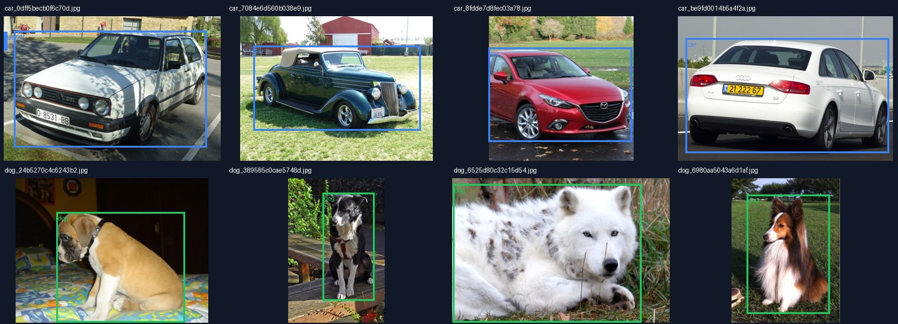
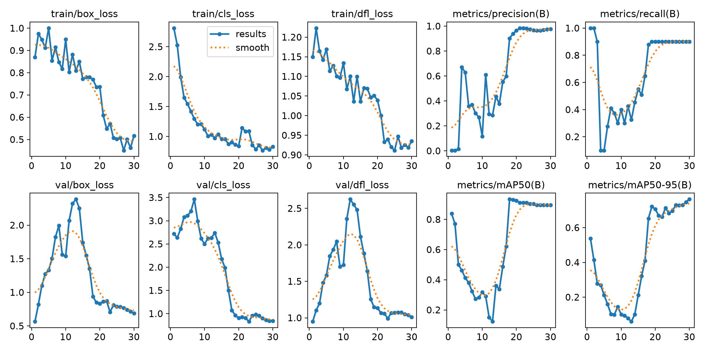

# FarmTech Solutions — Fase 6

**Aluno:** Samuel Soares Carvalho Lima  
**RM:** 572084  
**Grupo:** 46

Este repositório apresenta uma prova de conceito de visão computacional para distinguir e localizar **cachorros** e **carros**. O estudo compara uma YOLO customizada em dois tempos de treinamento, a YOLO padrão pré-treinada no COCO e uma CNN criada e treinada do zero.

[](https://colab.research.google.com/github/KAeHM/farmtech-fase6-rm572084/blob/main/SamuelSoaresCarvalhoLima_rm572084_pbl_fase6.ipynb)

## Entrega principal

O notebook executado, com código comentado, gráficos, métricas, imagens processadas e conclusões, está em:

- [SamuelSoaresCarvalhoLima_rm572084_pbl_fase6.ipynb](SamuelSoaresCarvalhoLima_rm572084_pbl_fase6.ipynb)

O projeto cobre as duas partes solicitadas:

1. criação de uma base com 80 imagens rotuladas e treinamento da YOLO customizada por 30 e 60 épocas;
2. comparação entre YOLO customizada, YOLO padrão e uma CNN implementada do zero.

## Dataset

Foram selecionadas **40 imagens de cachorro** e **40 imagens de carro** do Open Images. Cada classe foi dividida da seguinte forma:

| Classe | Treino | Validação | Teste | Total |
|---|---:|---:|---:|---:|
| Cachorro | 32 | 4 | 4 | 40 |
| Carro | 32 | 4 | 4 | 40 |
| **Total** | **64** | **8** | **8** | **80** |

As caixas delimitadoras humanas do Open Images foram convertidas para o formato YOLO, compatível com o Make Sense AI. O arquivo [`manifest.csv`](data/openimages_dog_car/manifest.csv) registra o identificador, a divisão e a URL de origem de cada imagem. A seleção, os filtros e as licenças estão documentados em [DATASET.md](DATASET.md).



## Experimentos e resultados

Todos os testes usaram a mesma divisão de dados e a semente `572084`. A avaliação abaixo foi feita nas oito imagens reservadas para teste.

| Abordagem | Épocas | Acurácia de classe | Precisão | Recall | mAP50 | Treino |
|---|---:|---:|---:|---:|---:|---:|
| YOLO customizada | 30 | **100%** | 100% | 88,89% | 0,895 | 77,5 s |
| YOLO customizada | 60 | **100%** | 100% | 88,89% | 0,896 | 105,7 s |
| YOLO padrão COCO | — | 75% | 100% | 66,67% | — | sem novo treino |
| CNN do zero | 30 | 75% | 83,33% | 75% | — | 33,3 s |

Para as YOLO customizadas, precisão e recall na tabela foram calculados com IoU ≥ 0,50 e confiança ≥ 0,25. A métrica mAP50-95 da validação oficial foi **0,866** com 30 épocas e **0,852** com 60 épocas.

### Conclusão

A **YOLO customizada de 30 épocas** oferece o melhor equilíbrio. Dobrar o número de épocas praticamente não alterou o mAP50, reduziu levemente o mAP50-95 e elevou o tempo de treinamento. A YOLO padrão é a opção de integração mais simples, mas recuperou menos objetos no recorte de teste. A CNN do zero demonstrou o processo de aprendizagem sem pesos pré-treinados, porém classifica a imagem inteira e não localiza o objeto.

O conjunto de teste é pequeno; portanto, os percentuais servem como evidência de uma prova de conceito e não como estimativa definitiva de desempenho em produção. A análise completa está no notebook e em [RESULTADOS.md](RESULTADOS.md).



## Estrutura do repositório

```text
.
├── data/openimages_dog_car/      # imagens, rótulos YOLO, manifesto e YAML
├── evidencias/                   # amostra visual auditável
├── modelos/                      # melhores pesos customizados e CNN
├── resultados/                   # métricas, curvas, matrizes e predições
├── scripts/                      # preparação, validação e experimentos
├── DATASET.md                    # origem, filtros, divisão e licenças
├── RESULTADOS.md                 # comparação detalhada
├── requirements.txt              # versões usadas
└── SamuelSoaresCarvalhoLima_rm572084_pbl_fase6.ipynb
```

## Como reproduzir

Recomenda-se Python 3.12 e uma GPU compatível com CUDA. Em CPU, o treinamento será consideravelmente mais demorado.

```bash
python -m venv .venv
```

No Windows PowerShell:

```powershell
.venv\Scripts\Activate.ps1
pip install -r requirements.txt
python scripts/validate_dataset.py
python scripts/run_experiments.py
jupyter notebook SamuelSoaresCarvalhoLima_rm572084_pbl_fase6.ipynb
```

No Linux ou macOS:

```bash
source .venv/bin/activate
pip install -r requirements.txt
python scripts/validate_dataset.py
python scripts/run_experiments.py
jupyter notebook SamuelSoaresCarvalhoLima_rm572084_pbl_fase6.ipynb
```

O script de experimentos reutiliza resultados existentes. Para refazer todos os treinamentos, execute `python scripts/run_experiments.py --force`. Para reconstruir a base a partir das fontes oficiais, execute `python scripts/prepare_dataset.py`.

No Google Colab, clone o repositório, instale `requirements.txt` e abra o notebook. Por padrão, `RUN_TRAINING=False` preserva os resultados já executados; altere para `True` somente se desejar repetir os treinamentos.

## Observação sobre a entrega

O vídeo demonstrativo solicitado na rubrica não foi incluído por decisão do autor. Todo o código, as saídas executadas, os pesos e as evidências estáticas permanecem disponíveis para avaliação.

## Licenças

O código deste repositório usa a licença MIT, descrita em [LICENSE](LICENSE). As imagens e anotações seguem as licenças e condições do Open Images, detalhadas separadamente em [DATASET.md](DATASET.md).
